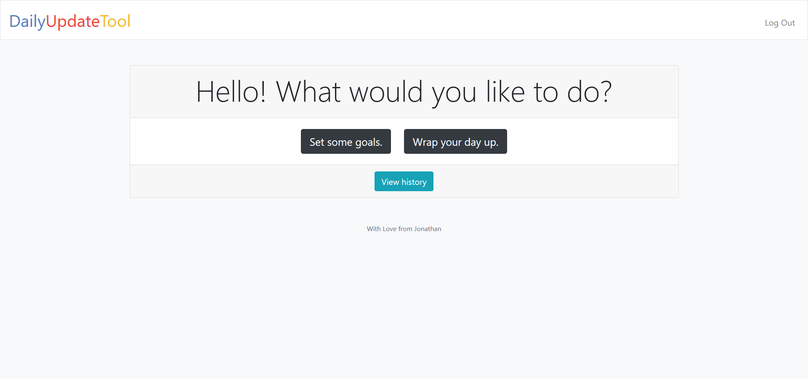

# DAILY UPDATE TOOL

## About The Project

This webtool is made so that people can plan their day. On every morning you are able to set yourself some goals which you want to achieve. To wrap up a day you can enter issues you stumbled upon and also reflect about what you achieved. Finally it is possible to enter your mood.
Moreover there is a history tab where you can see older entries. There you can also edit entries.

Here's why you should use this tool:
* Thinking about your goals for the day strengthens your focus on the most important things
* Wrapping up your day you gives you insights on what went good or bad.
* Moreover you get an overview about how your mood was in the last time (and in future your manager gets an better impression about how happy you are)

A list of commonly used resources that I find helpful are listed in the acknowledgements.

### Built With

This tool is built with Bootstrap and Flask.
* [Bootstrap](https://getbootstrap.com)
* [Flask](https://flask.palletsprojects.com/en/1.1.x/)

## Getting Started

First of all users can create a profile. Therefore they have to click on the register link. They need to enter an email-address, their first and last name and a password.

## Usage

After logging in users are getting navigated to the index page. There they have the opportunity to either get redirected to the 'goals' page or the 'wrap up' page. Moreover they can get to the 'history page as well.

## Roadmap

The history tab is going to get more functionality so that users can get more insights. Furthermore there should be the option to create groups so that managers can see what their coworkers are doing or which issues are bothering them.
Additionally a function extension is possible so that coworkers could find dates for meetings easily.

## License

Distributed under the MIT License.

## Contact

Jonathan Liese - [@averageronny](https://twitter.com/averageronny) - jonathan.liese@web.de

## Acknowledgements
* [GeeksForGeeks](https://www.geeksforgeeks.org)
* [CSS Tricks](https://css-tricks.com/)
* [Emojipedia](https://emojipedia.org)
* [Favicon Generator](https://www.favicon-generator.org/)
* [Stackoverflow](stackoverflow.com/)
